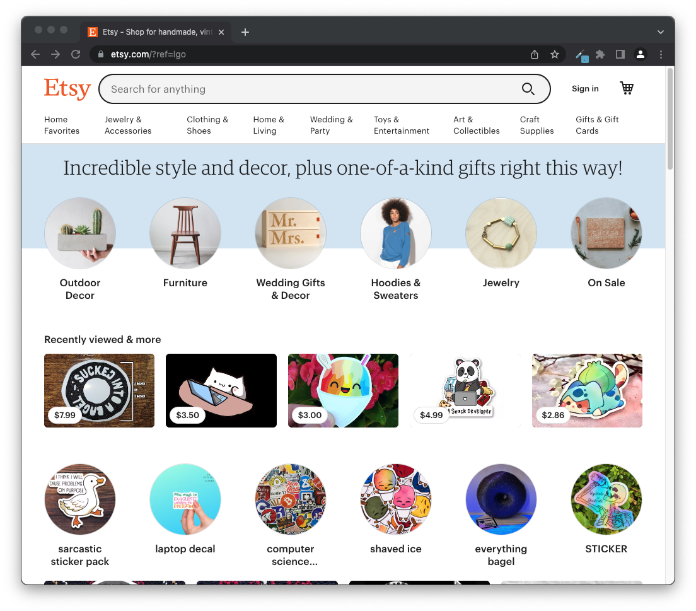

<!-- UI Frameworks are not simple. In fact, they can be almost as complicated to learn as a new programming language. Given that, why bother to use something like Bootstrap 5? What does one get in return for the investment of time and frustration? Why not just use raw HTML and CSS? Are the software engineering benefits of UI frameworks?

For this assignment, create an engaging and informative essay about UI Frameworks. You might want to discuss some of the issues raised above, as well as your own personal experience with Bootstrap 5. Or perhaps you’ve also used another framework such as Semantic UI. In that case, it might be interesting to read your perspective on a comparison of the two.

This essay is tailor made to include an image of a web page built with a UI framework (or even a comparison of web pages built with and without a UI framework).

Feel free to go in another direction entirely, as long as you are discussing UI Frameworks, and as long as the result is interesting, informative, and insightful. Write for the world! -->

## Subtitle 1

Paragraph 1

## Subtitle 2

Paragraph 2

## Subtitle 3
Paragraph 3