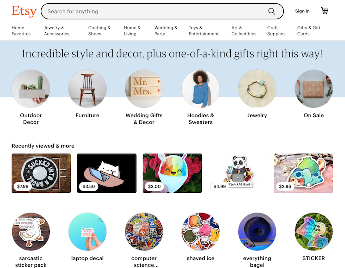
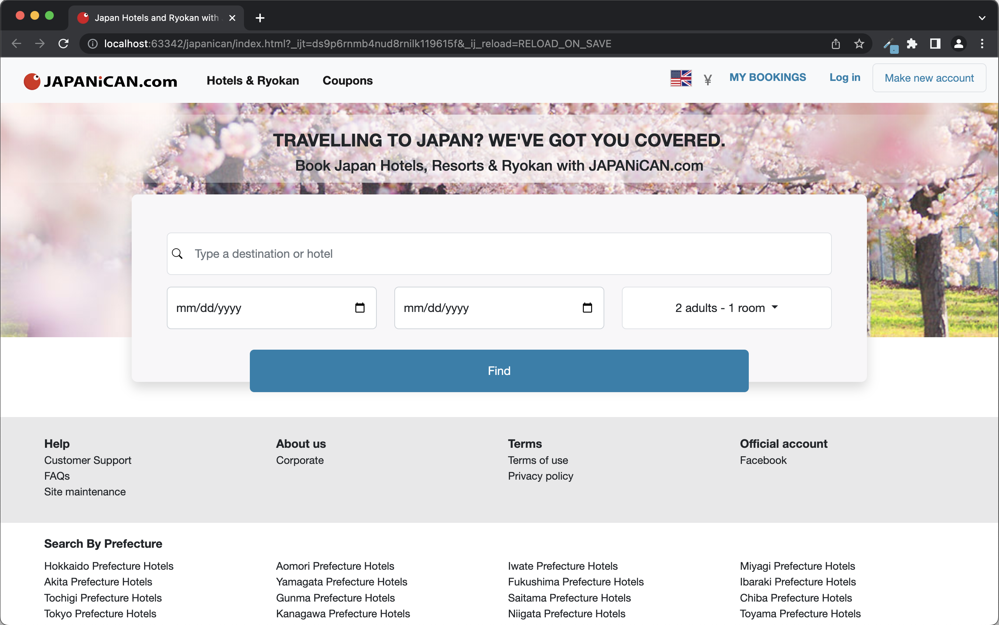

<!-- UI Frameworks are not simple. In fact, they can be almost as complicated to learn as a new programming language. Given that, why bother to use something like Bootstrap 5? What does one get in return for the investment of time and frustration? Why not just use raw HTML and CSS? Are the software engineering benefits of UI frameworks?

For this assignment, create an engaging and informative essay about UI Frameworks. You might want to discuss some of the issues raised above, as well as your own personal experience with Bootstrap 5. Or perhaps you’ve also used another framework such as Semantic UI. In that case, it might be interesting to read your perspective on a comparison of the two.

This essay is tailor made to include an image of a web page built with a UI framework (or even a comparison of web pages built with and without a UI framework).

Feel free to go in another direction entirely, as long as you are discussing UI Frameworks, and as long as the result is interesting, informative, and insightful. Write for the world! -->

## Please, come here. No, not there. Over here.

To say that I find HTML and CSS frustrating is an understatement. In my last essay, I attempted to float a photo on the left of a single paragraph. Unfortunately, I wasn’t able to figure it out. I decided to put the image on its own line and called it a day.

Placing an image in a particular spot seems like it should be a simple task. When I make a collage using paper and photos I can physically lay out things where I want with ease. Not so with pure HTML and CSS! 

Enter Bootstrap 5. The amount of customization allowed with Bootstrap 5 is convenient. Up until a week ago, I had no experience with Bootstrap or any UI framework. The ability to enter a few words into HTML and have an expandable and collapsible navigation bar was a surprise.

## Why, frameworks?

The amount of effort put into making something “pretty” seems counter to what I actually want to focus on: functionality. Even though UI design is not my favorite part of software development, I know that it's important. Clients and users are not likely to use an interface that is visually unappealing or clunky.

While there is a learning curve, the advantage of using Bootstrap 5 over pure HTML and CSS is in the amount of time saved. With Bootstrap, you can create a nice mockup of your web application out of the box. This allows you to spend more time on the application's back end.

Another bonus is Bootstrap's use of responsive grids and images which allows for a good presentation on a wide range of screen sizes. The switch from computer browser to mobile isn’t without kinks; however, the amount of work required to make components presentable on any device is reasonable.

## Bootstrap in Action

I recently learned that one of my favorite websites is built using Bootstrap 5. Etsy is an online marketplace primarily for sellers of handmade or vintage items. 

  

    

      
      
 Home Page with Full Width

    

    

      
      
 Mobile Preview of Home Page

  

The layout of the website is great for finding interesting items. It's simple, clean, and easy to navigate. Here, their use of Bootstrap allows for a seamless transition to a small screen.

## The Negative
There are a few downsides to using Bootstrap 5. First, if you use CDN via jsDelivr and the host goes down for any reason, your site will not work correctly. Another criticism is that many Bootstrap-built sites have the same cookie-cutter look. So if you want to stand out from the crowd, you will have to apply more customized settings. This leads to another con, that customization for Bootstrap 5 is not the simplest and at some point, it may be more beneficial to use raw HTML and CSS. One more critique is that Bootstrap often ends up as a substitute for learning HTML and CSS properly. Admittedly, I have a tenuous grasp of HTML and CSS - while it is very convenient - Bootstrap has abstracted away how and why it works.

## Final Thoughts
I spent many hours using Bootstrap 5 to recreate a webpage. There were several features that I was not able to implement using Bootstrap alone; however, I know that with raw HTML and CSS, it would have taken significantly more time to reproduce. Admittedly there was some frustration, but the amount of time I saved to get similar results as the original was worth the effort.

  

    

      
      
Original Page

    

    

      
      
Remake with Bootstrap 5

    

  
