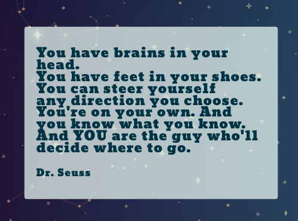

<!--Third, create a technical essay (approximately 3-4 paragraphs) that discusses your interests in software engineering and what kinds of skills and experiences you hope to develop in future.-->

## The Start
I can't say that I've always been interested in programming. For a long time, I thought the internet and computers were mystical things that operated magically and any task involving a terminal could break the whole thing. 

My first experience with programming was in 2011 when I took Introduction to Computer Science I. At the time, I didn’t know what to expect. The topic seemed interesting enough and I needed a course to fulfill my degree requirements. I had no idea what Java was and thought Javascript was just what they called Java code. Eventually, I learned that they are not the same, and that semester I began my first foray into Java programming.

## Discovering My Interests
It has been several years since that first semester and I’ve had a long gap of not programming. I’m not really sure about what my interests in software engineering are. One of the reasons I’ve decided to take ICS 314 is to discover what I like about software engineering. I have been a Math instructor for several years and it has been a rewarding career. One thing that I have been missing is being able to work on Math in a more applied setting. Programming has allowed me to rekindle my love for problem-solving and software engineering seems like a perfect career to pivot into. One interest that has cropped up in the past as an educator, is that I would like to incorporate my knowledge in math and science into resources that will help students.

## Goals for the Future
Most of my experience in programming involves using a CLI to run code. While that has its uses, I would like to turn my ideas into actual applications and programs that anyone can access. One goal of mine is to learn how to design user-friendly and accessible interfaces. I would also like to gain more experience in collaborating with others on projects. My ultimate goal is to get a job as a software engineer, so I would like to develop the skills necessary to achieve that goal. I hope to get at least one internship in the tech industry to help me experience the workforce and to gain more skills as a developer.
