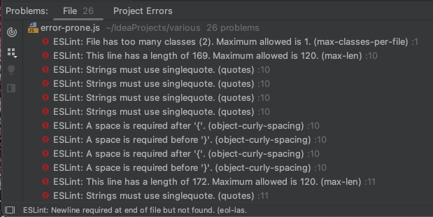
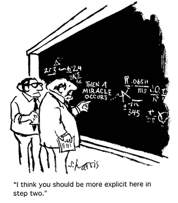

<!-- Some coding standards can actually help you learn a programming language. Do you agree?

After your first week of using ESLint with IntelliJ, what are your impressions? Are you finding that getting the green checkmark is painful, or useful, or both, or something else entirely?

Write an interesting, informative essay on coding standards that addresses some or all of the above questions, or goes in a different direction entirely regarding coding standards. Make sure it provides your personal perspective and useful insights.. -->


## It Works, Doesn't It?
The following code was written for a WOD to practice Javascript Object Orientation. If you were to run it on JSFiddle or through Node, it should work perfectly fine.

```javascript
class MenuItem {
  constructor(name, ingredients, prices, calories) {
    this.name = name;
    this.ingredients = ingredients;
    this.prices = prices;
    this.calories = calories;
  }
}

const papayaSunrise = new MenuItem("Papaya Sunrise", ["papaya", "strawberry", "peach"], {small: 5.15, medium: 5.75, large: 6.55}, {small: 190, medium: 280, large: 330});
const peachPerfection = new MenuItem("Peach Perfection", ["mango", "strawberry", "peach"], {small: 5.15, medium: 5.75, large: 6.55}, {small: 210, medium: 320, large: 360});


class Menu {
  constructor() {
    this.menuList = [];
  }

  addMenuItem(item) {
    this.menuList.push(item);
  }

  findMenuItems(ingredient) {
    let foundItems = [];

    for (let item of this.menuList) {
      if (item.ingredients.indexOf(ingredient) >= 0) {
        foundItems.push(item);
      }
    }
    return foundItems;
  }
}

let myMenu = new Menu;

myMenu.addMenuItem(papayaSunrise);
myMenu.addMenuItem(peachPerfection);

console.log(myMenu.findMenuItems("mango"));
```

However, a funny thing happened when I viewed the code in IntelliJ with ESLint.



Much to my chagrin, 26 errors popped up! At first glance, all of these warnings seem more like nitpicking than constructive error-checking. If it works, then does it matter that I used double quotes instead of single quotes?

I've graded a lot of math quizzes and exams over the years and every semester, without fail, there has been at least one student-written solution that had the correct answer at the end, but the logic in the middle didn't quite make sense.
<div>


This occurrence was usually followed with: "Why did you take off points? I got the correct answer," and an attempt to convince the student that writing a clear, logical argument that follows the rules of math was just as important as getting the correct answer.

Following a coding standard serves a similar purpose in programming. I can write code that works, but it would really be much better to write code that works AND can be easily understood by someone else. A good way to accomplish the latter is to follow the coding standards for the language.
</div>
Credit: [Sidney Harris Science Cartoons Plus](http://www.sciencecartoonsplus.com/gallery/math/index.php)

## Check Please!
I dislike notifications on my screen. That little number or red flag indicating that something needs tending to or is incomplete is displeasing. Seeing that exclamation point and number feels a bit like someone shouting, “Look at all the things you’ve done wrong!” It would be nice if I could write my code perfectly every time, but alas I'm human.

Fortunately, as I’ve grown more familiar with the standards, I have seen that the error count stays low. I also find that I’m a lot more careful with how I write code. I especially like ESLint’s “quick fix” feature which takes care of most of those errors with a few clicks. While I don't want to see all of the errors, it is satisfying to see that green checkmark appear with little fuss.


## You're Welcome, Future Me.
I  like the idea of a coding standard. When everyone follows the same rules it makes reading the code much easier. As our projects get longer and more complex, following the guidelines will allow for readability and maintainability. Ultimately, this will help future me and others in creating good software.