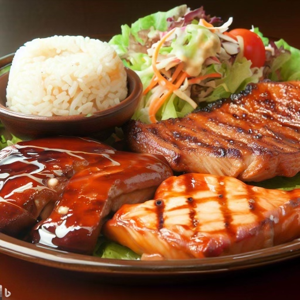

<figure class="text-center">

<figcaption>Bing Image Creator's Attempt at a Teriyaki Factory</figcaption>
</figure>

## A Summary

Design patterns provide general reusable solutions from experienced software developers that address common problems.

Some examples include: Factory Design Pattern, Model-View-Controller Design Pattern, Prototype Design Patter, Singleton Design Pattern, Observer Design Pattern. These design patterns and others help software engineers approach common problems with tested solutions.

## An Example: Teriyaki Factory: Competition for [May’s Hawaii](https://www.purityfoodshawaii.com/mayshawaii).

Since I am a human and definitely not a robot or A.I., I have a lifetime’s worth of experience with food. I also have some experience with cooking. Over the years, I have learned several cooking techniques that can apply to many sets of ingredients.

Teriyaki-style food is very popular here in Hawaii and we want to capitalize on this fact. Suppose we want to create a business that provides retail stores and restaurants ready-to-cook food.

One way to do this is to create a Teriyaki Factory. Since this will be a new business, we’ll start with hamburger patties and chicken thighs. The factory will prepare these options using a function called:
makeTeri()

Now, makeTeri() will do the following.
1. Prepare teriyaki sauce
2. Marinate protein in teriyaki sauce.
3. Package for shipping.

The above is an example of a Factory Design Pattern. It takes in a parameter (protein) and a ready-to-cook teriyaki protein comes out. The benefit of this approach is that if I want to add another protein to the menu, I only need to modify the makeTeri() function instead of creating a whole new process.

<figure class="text-center">

<figcaption>Bing Image Creator's Attempt at a Teriyaki Plate</figcaption>
</figure>

## [Taste Technologists](https://taste-technologists.github.io/) - A Plate Full of Design Patterns
For the ICS 314 Final Project, my group and I are working on a web application called “Taste Technologists” that provides easy recipes for college students with minimal kitchen resources. Since starting, our application has quickly turned into a large collection of code. Most of our experience has come from working with the [Meteor-Application-Template-React](https://ics-software-engineering.github.io/meteor-application-template-react/) (MATR) code and applying the techniques used in this template to create our own “stuff”. Without realizing it, we were actually using the Design Patterns we hadn’t yet learned about.
Some of the Design Patterns that we are using include:

### Model-View-Controller (MVC) Design Pattern:
Since our application is based off of MATR, it uses the MVC pattern where MongoDB is our Model - it's the database that stores our data; React is our View - the React components are the things presented to our users; and React Router is our Controller which handles the routing to the various pages.

### Prototype Design Pattern: 
To handle the Recipes, User Profiles, Vendor, and Inventory data, we’ve created several classes to hold the state and variables for each of our collections.

### Singleton Design Pattern: 
Inside these classes we also have singleton instances of each of our collection – that is – we created a single instance of each of our collections to manage the database.

Click to see the use of Prototype and Singleton Design Patterns

Note that while this code uses the keyword "class" to create this object, Javascript uses the Prototype Design Pattern.

<pre>
<code>
import { Mongo } from 'meteor/mongo';
import SimpleSchema from 'simpl-schema';

/**
 * The VendorInventoryCollection. It encapsulates state and variable values for the VendorInventory.
 */
class VendorInventoryCollection {
  constructor() {
    // The name of this collection.
    this.name = 'VendorInventoryCollection';
    // Define the Mongo collection.
    this.collection = new Mongo.Collection(this.name);
    // Define the structure of each document in the collection.
    this.schema = new SimpleSchema({
      name: String,
      item: String,
      price: Number,
      size: String,
    });

    // Attach the schema to the collection, so all attempts to insert a document are checked against schema.
    this.collection.attachSchema(this.schema);
    // Define names for publications and subscriptions
    this.userPublicationName = `${this.name}.publication.user`;
  }
}

/**
 * The singleton instance of the RecipeCollection.
 * @type {VendorInventoryCollection}
 */
export const Inventory = new VendorInventoryCollection();

</code>
</pre>

### Publish-Subscribe Design Pattern: 
Meteor paired with MongoDB uses a Publication/Subscription model which is an example of the Observer Design Pattern. In the server side startup code, we use Meteor Publications to allow users of various roles to access the data in our MongoDB collections. In order to view this data, many of the application's pages subscribes to one (or more) collections. This also allows users to get updated data as it happens.

## Final Thoughts
Working on Taste Technologists has been a challenging experience. It would undoubtedly be much more difficult if we didn't have the benefit of Design Patterns. Our application heavily relies on them to help manage our data, present a usable UI, and make everything work.
