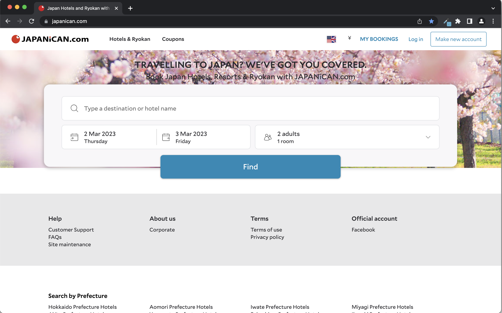

<!-- A common interview question is “What are design patterns?”, followed by “What design patterns have you used in your own code?”

For this technical essay, you will write an interesting and informative technical essay that ends up answering these two questions. By doing so, you’ll be better prepared to answer this question if it comes up in an interview.

Do not, under any circumstances, write two paragraphs, one with the title “What are design patterns?” and one with the title “How I have used them in my code.” That will get you no points, as such an essay would be too boring for anyone to read.

Instead, write an essay, perhaps using metaphor or analogy, which by its conclusion has answered these two questions but in a clever, interesting, and informative fashion. -->

## Please, come here. No, not there. Over here.

## Why, frameworks?

## Bootstrap in Action

## Final Thoughts
I spent many hours using Bootstrap 5 to recreate a webpage. There were several features that I was not able to implement using Bootstrap alone; however, I know that with raw HTML and CSS, it would have taken significantly more time to reproduce. Admittedly there was some frustration, but the amount of time I saved to get similar results as the original was worth the effort.

  

    

      
      
Original Page

    

    

      
      
Remake with Bootstrap 5

    

  
