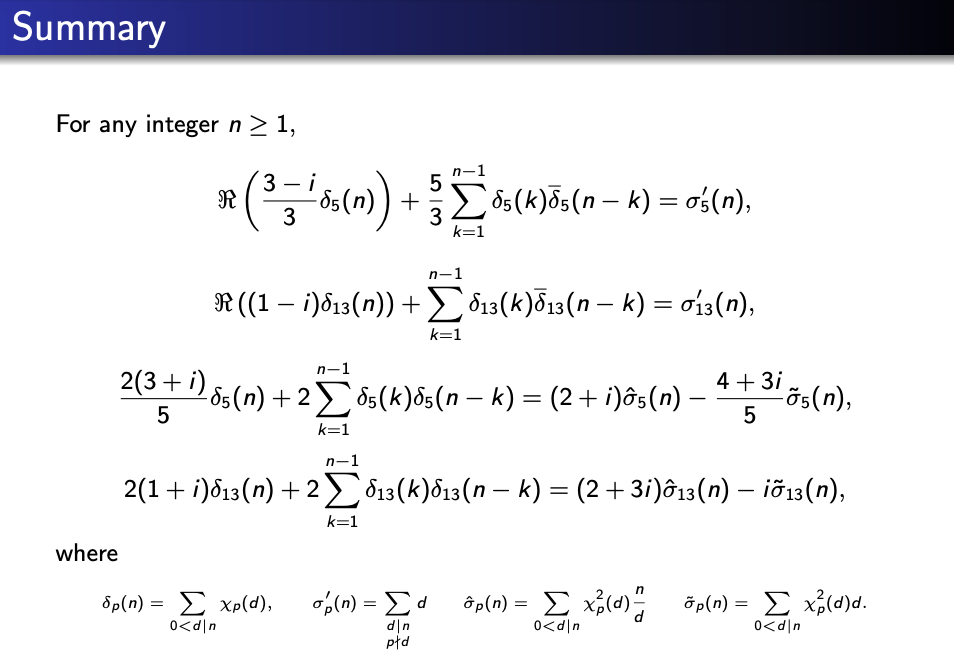

  

In addition to fulfilling the course and credit requirements, the University of Hawaii's M.A. in Mathematics program also requires a written paper whose contents are presented to the public. 

For this project, I was the author and sole presenter and Dr. Pavel Guerzhoy was my advisor. The goal of my master's project was to find some interesting mathematical identities using a modular forms approach. 

I learned several several useful skills from this endeavor. Before I proved the general results, I learned to use PARI/GP, a computer algebra system. The program allowed me to verify the first several thousand identities to make sure I was on the right track. I also honed my presentation skills for public speaking and learned how to create Math-Friendly Slideshows using LaTeX Beamer.
