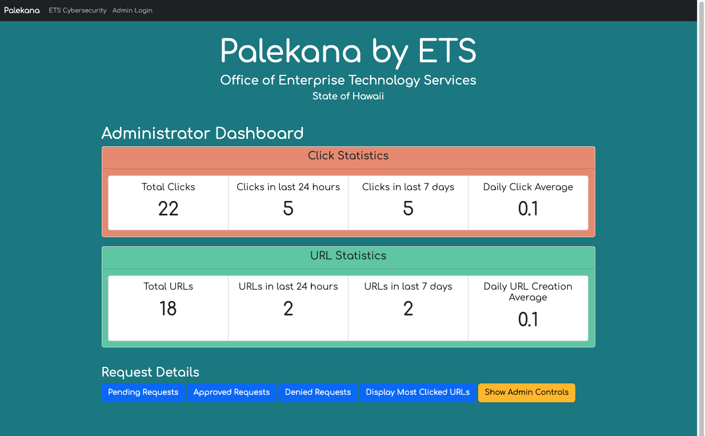

<div class="text-center p-4">
  
  
</div>

The Hawaii Annual Code Challenge (HACC) is a hackathon initiated by Gov. David Ige in 2015, aimed at modernizing state functions and fostering the local tech industry. Unlike traditional hackathons, HACC spans weeks, enabling collaborative solutions between community teams and state departments.

My team participated in the HACC 2022 Hackathon (Oct-Nov 2022), where we created Palekana: a secure URL Shortening App tailored for government employees. Palekana enables the effortless creation and curation of safely-shortened URLs, ensuring a secure online environment for public distribution. Our app addresses online security concerns and promotes safer online interactions.

For this project, we utilized a range of technologies, including Python, Flask, and SQL, to seamlessly integrate robust back-end functionalities. This allowed us to achieve secure URL shortening through effective hash encoding/decoding. 

For the front-end, we combined Python, Flask, and SQLite, to seamlessly integrate robust back-end functionalities. This allowed us to achieve secure URL shortening through effective hash encoding/decoding. 

On the user-friendly front-end, we blended HTML, CSS, JS, jQuery, and Bootstrap to create an intuitive interface. Our solution includes efficient Create, Read, Update, and Delete (CRUD) operations, all driven by SQLite, ensuring smooth management of shortened URLs. Our collective efforts resulted in Palekana, an innovative web app that not only showcases technical skills but also directly addresses real-world security challenges.

## What I learned
This is the second hackathon that I have participated in.  I achieved a significant milestone by contributing to the development of my first app with database functionality. Being a part of a team that utilized the Flask framework, implemented SQL CRUD operations, and effectively managed user logins not only expanded my skill set but also deepened my understanding of web app development.

Here's the SQL code we used to set up our database and tables. The 'urls' table is where we store important info about shortened URLs, including their original links and user details. On the other hand, the 'clicks' table keeps track of each time someone clicks on a shortened URL, noting both the original and shortened links involved:

```sqlite
CREATE TABLE urls (
	id INTEGER PRIMARY KEY AUTOINCREMENT,
	created_at TIMESTAMP NOT NULL DEFAULT CURRENT_TIMESTAMP,
	original_url TEXT NOT NULL,
	clicks INTEGER NOT NULL DEFAULT 0,
	first_name TEXT NOT NULL,
	last_name TEXT NOT NULL,
	email TEXT NOT NULL,
	status TEXT NOT NULL DEFAULT 'PENDING'
);

CREATE TABLE clicks (
	id INTEGER PRIMARY KEY AUTOINCREMENT,
	created_at TIMESTAMP NOT NULL DEFAULT CURRENT_TIMESTAMP,
	shortened_url TEXT NOT NULL,
	original_url TEXT NOT NULL
);
      
```

You can learn more about this hackathon submission at [Github](https://github.com/ashburnb/PalekanaURLShortener).
