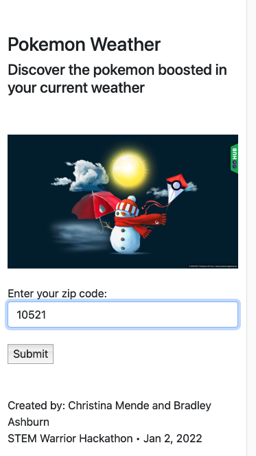
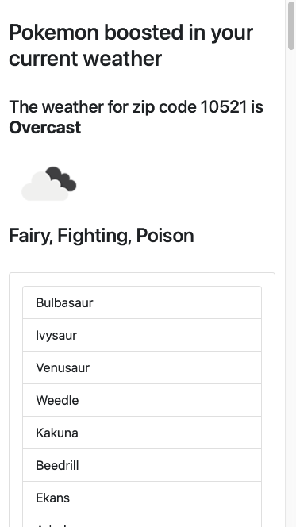
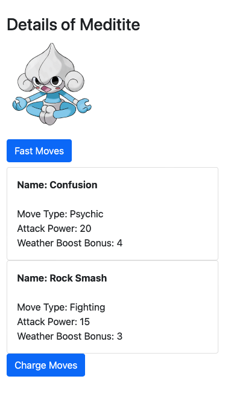

<div class="text-center p-4">
  
  
  
</div>

STEM Warrior Hacks (Winter Dec 31, 2021 - Jan 2, 2022) is an international student-run hackathon open to anyone 13 years and older. It is a hands-on event which allows beginner coders to learn new skills and gain first-hand experience in programming in teams. This hackathon was open-themed in that teams could create any type of program. My team and I decided to create a fun app centered on our favorite game: Pokemon Go.

For this project, I  was responsible for the backend (server-side) code. I used OpenWeatherMap API to access relevant weather data for each zip code . I also used PoGo API and PokeApi to retrieve information related to each Pokemon's data such as type, move set, and stats. 

## What I learned
Prior to this hackathon I had little-to-no experience with developing a web app. In order to contribute to this project, I learned basic HTML and CSS through CodeAcademy and Javascript through FreeCodeCamp. 

Here is some code that illustrates how we categorized weather type based on the ID retrieved by the OpenWeatherAPI:

```ruby
      <!--Gets weather ID -->
      <% weatherID = JSON.pretty_generate(weather_json["weather"][0]["id"]).to_i  %>

      <!--Gets wind speed in mph -->
      <% wind = (weather_json["wind"]["speed"] * 2.236936).round(2) %>


      <!-- weather ID codes that correspond to weather type -->
      <% weather_hash = {[200,201,202,230,231,232,300,301,302,310,311,312,313,314,321,500,501,502,503,504,511,520,521,522,531] => "Rainy",[600,601,602,611,612,613,615,616,620,621,622] => "Snow", [800] => "Clear", [804] => "Overcast",[801,802,803] => "Partly Cloudy",[701,741] => "Fog"} %>

      <!-- matches code with weather type to set current_weather -->
      <% current_weather = "" %>
      <%weather_hash.each do |code,type| %>
        <% current_weather = type if code.include?(weatherID) %>
      <% end %>

      <!-- Wind takes precedence over these -->  
      <% if ((current_weather == "Clear" || current_weather == "Overcast" || current_weather == "Partly Cloudy") && wind >= 55) %>
        <% current_weather = "Windy" %>
      <% end %>
```

You can learn more about this hackathon submission at [Devpost](https://devpost.com/software/pokemon-weather-app).
