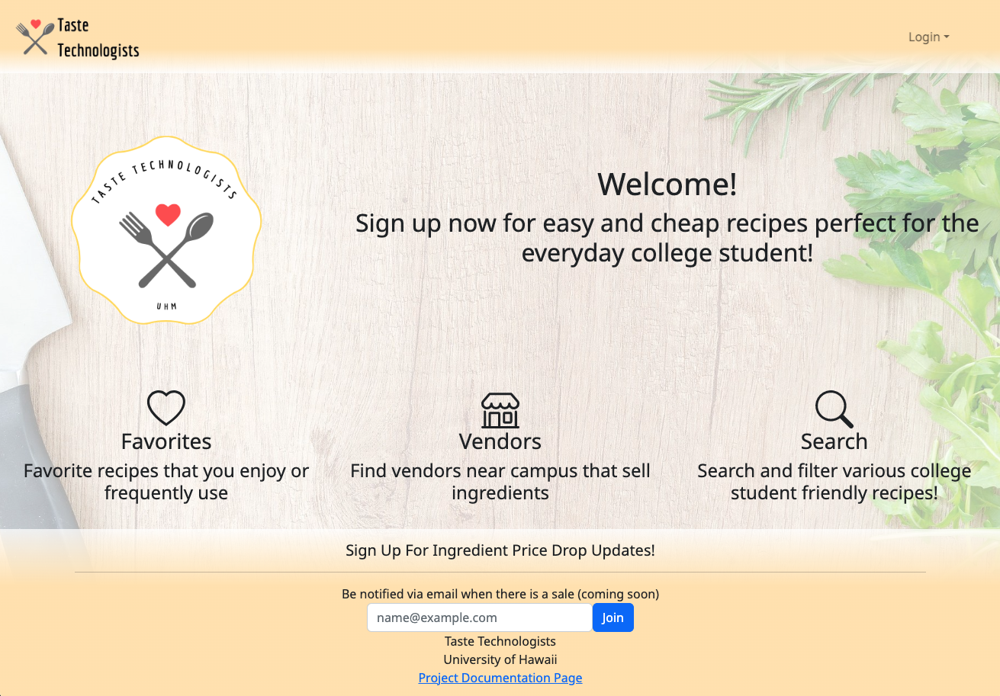
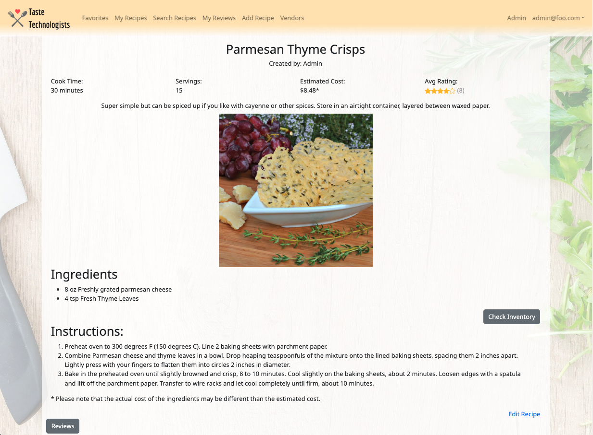
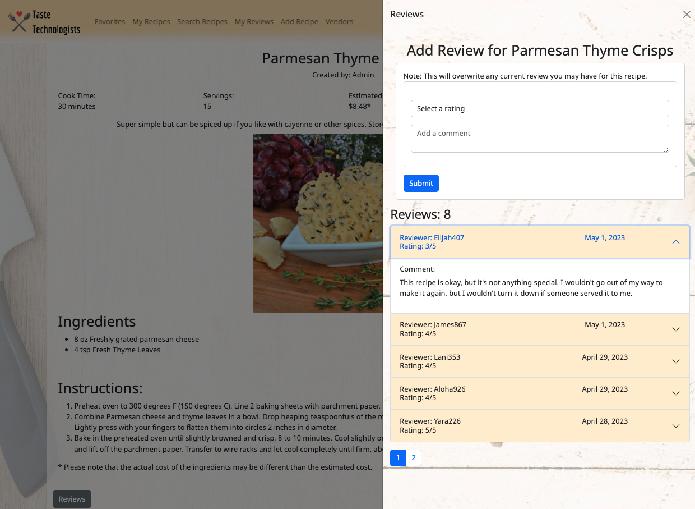

<div class="text-center p-4">
  
</div>

## Overview

As part of our group final project, my team and I were tasked with implementing the ideas behind [Toaster Oven Lovin'](https://courses.ics.hawaii.edu/ics314s23/morea/final-project/reading-project-toaster-oven-lovin.html). We used the [Meteor-Application-Template-React](https://ics-software-engineering.github.io/meteor-application-template-react/) template as the starting point for the application. The application uses Meteor with MongoDB, React, Bootstrap 5 to implement the functionality and design.

Taste Technologists was designed to give students (on-campus or off) a variety of easy and delicious recipes that:

* Can be made using minimal kitchen facilities (at a minimum, a toaster oven).
* Can be made out of ingredients that are available within walking distance of UH.
* Suit local taste sensibilities.
* Can be filtered via dietary restrictions (gluten-free, vegan, etc.).
* Have an estimated cost per serving.
* Has an estimated number of servings per recipe.
* Has an estimate of how long it takes to make.

For this project, each member of the team was responsible for both front-end and back-end (server side) code. Some of my responsibilities included: 
* Creating schemas for and publishing the Recipes, Vendor, and VendorInventory Collections.
<br />
* Creating the Admin Panel which allows admin to edit content in the system, remove inappropriate content, and establish users as having the vendor role.

You can view the Admin Panel in action here: 

<div style="position: relative; padding-bottom: 56.25%; height: 0; overflow: hidden;" class="text-center">
  <iframe style="position: absolute; top: 0; left: 0; width: 100%; height: 100%;" src="https://www.youtube.com/embed/S_kzsacqo9Y" title="YouTube video player" frameborder="0" allow="accelerometer; autoplay; clipboard-write; encrypted-media; gyroscope; picture-in-picture; web-share" allowfullscreen></iframe>
</div>
<br/><br/>
* Creating the Individual Recipe page which shows the recipe's information.
<div class="text-center p-4">
  
</div>


* Implementing the Recipe Rating and Review feature for each recipe.
<div class="text-center p-4">
  
</div>

## What I learned

This project was a challenging experience since it was the first time that I was involved in writing code for both the front-end and back-end of a web application. 

In carrying out my responsibilities, I learned about:
* the differences between making changes to the MongoDB collection from the client-side vs. the server side,
* the importance of hiding public access to user data through Meteor Publications,
* how to work collaboratively with my teammates who each have their own coding style and approach to designing web applications.

The following is a sample of the code used to render and implement the rating/review feature.

The rating/reviews form and comments appear in an Offcanvas Bootstrap component that is accessed via the recipe page by pressing on the "Reviews" button at the bottom of the page.

This code renders the Review Menu.
```jsx
 <>
   <Button variant="secondary" id="review-button" onClick={handleShow} className="me-2">
     Reviews
   </Button>
   <Offcanvas show={show} onHide={handleClose} placement="end" className="bg-img">
     <Offcanvas.Header closeButton>
       <Offcanvas.Title>Reviews</Offcanvas.Title>
     </Offcanvas.Header>
     <Offcanvas.Body>
       <AddReview name={name} recipeId={recipeId} userID={userID} user={user} />
       <h3>Reviews: {reviewCount}</h3>
       <Accordion>
         {currentItems.map((rev, idx) => (
           <RecReviewItem key={idx} idx={idx} review={rev} />
         ))}
       </Accordion>
       <Pagination className="my-3">
         {paginationItems}
       </Pagination>
     </Offcanvas.Body>
   </Offcanvas>
 </>
```
The AddReview component contains the form for users to submit their review for a recipe.

When a user submits a recipe review, they only need to provide a rating on a scale of 1 to 5 and a comment. After completing the form and hitting 'submit,' the submit function initiates a Meteor call to the Review.add Meteor method. Because users are logged in when creating a review, their identifying information can be easily accessed and passed along with the review to the Meteor method.

The following code executes once the user has correctly filled out the form and pressed the submit button:

```javascript
  const submit = (data, formRef) => {
    const { rating, comment } = data.review[0];
    const reviewInfo = { userID, user, rating: Number(rating), comment, created: new Date() };
     Meteor.call(addReviewMethod, { recipeId, reviewInfo }, (error) => {
       if (error) {
         swal('Error', error.message, 'error');
       } else {
         swal('Success', 'Review added successfully', 'success');
         formRef.reset();
       }
     });
  };
```

When the Review.add method is called, it removes the old review if one exists, and adds the new review.

```javascript
Meteor.methods({
  'Review.add'({ recipeId, reviewInfo }) {
    // Pulls the old review
    RecReviews.collection.update(
      { recipeId: recipeId },
      { $pull: { review: { userID: reviewInfo.userID } } },
    );

    // Add the new review
    RecReviews.collection.update(
      { recipeId: recipeId },
      { $addToSet: { review: reviewInfo } },
    );
    console.log('Successfully added into RecipesReviews');
  },
});
```
If a recipe has one or more reviews, then they are rendered in the Review Menu as an accordion item.

```jsx
  /** Renders a single Accordion Item in the ReviewMenu Component. See components/ReviewMenu.jsx. */

  const RecReviewItem = ({ review, idx }) => (
  <Accordion.Item eventKey={idx}>
    <Accordion.Header>
      <Row className="w-100">
        <Col md={6} lg={6} className="text-start">
          Reviewer: {review.user}
        </Col>
        <Col md={6} lg={6} className="text-end text-lg-center">
          {new Date(review.created).toLocaleDateString('en-US', {year: 'numeric',month: 'long',day: 'numeric',})}
        </Col>
        <Col md={12} lg={12} className="text-start">
          Rating: {review.rating}/5
        </Col>
      </Row>
    </Accordion.Header>
    <Accordion.Body>
      <h6>Comment: </h6>
      <p className="review-comment">{review.comment}</p>
    </Accordion.Body>
  </Accordion.Item>
);
```

You can learn more about Taste Technologists at [https://taste-technologists.github.io/](https://taste-technologists.github.io/).
