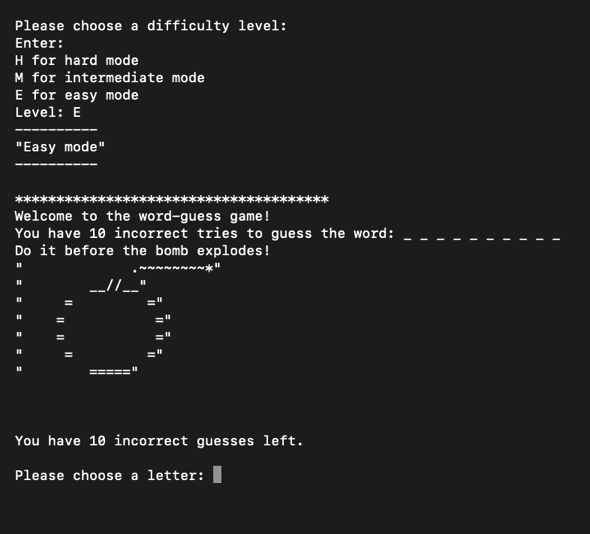
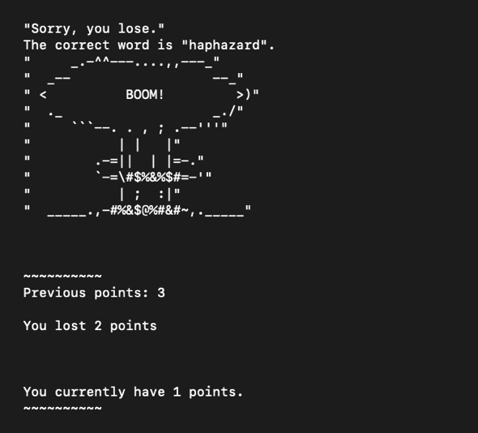

<div class="text-center p-4">
  
</div>

As a personal goal and to get back into programming, I spent the summer learning how to code using Ruby through App Academy Open. To get more practice, I was challenged by a friend to create this Hangman-inspired game. The game has a simple interface and is run through a Command Line Interface. It implements the knowledge I had learned in Ruby to complete several tasks:

1. Have three levels of difficulty
2. Allow for multiple rounds of the game until user quits
3. Implement a point system with a running total for the duration of gameplay
3. Employ error checking so that the user does not enter invalid or repeated characters
4. Incorporates ASCII art into the gameplay by visually showing the user how many guesses they have left and whether they've won or lost a round. 
<div class="text-center p-4">
  
  
</div>


## What I learned
This game was created to practice Ruby


```ruby

```

You can view the source code at [Source Code](https://github.com/mendechris/mendechris.github.io/blob/e3235a1df5d4ddf8171b9baf4a07edac9b6db01c/projects/hangman.rb).
