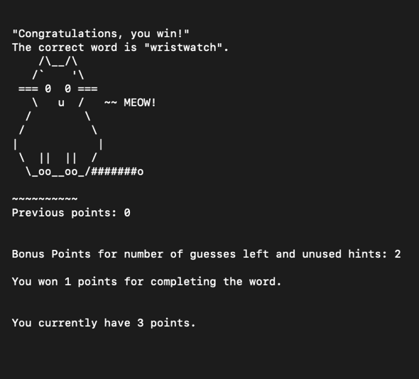

<div class="text-center p-4">
  
</div>

As a personal goal and to get back into programming, I spent the summer learning how to code using Ruby through App Academy Open. To get more practice, I was challenged by a friend to create this Hangman-inspired game. The game has a simple interface and is run through a Command Line Interface. 

## What I learned
For this program, I learned about simple game design.

It also implements the knowledge I had learned in Ruby to complete several tasks:

1. Have three levels of difficulty
2. Allow for multiple rounds of the game until user quits
3. Implement a point system with a running total for the duration of gameplay
3. Employ error checking so that the user does not enter invalid or repeated characters
4. Incorporates ASCII art into the gameplay by visually showing the user how many guesses they have left and whether they've won or lost a round. 
<div class="text-center p-4">
  
  
</div>

Below is a short snippet of code for error-checking the user's input:
```ruby

#check to make sure that user entered appropriate guesses. Loops if otherwise.
def inputcheck(guess,letter_track)
  guess = gets.chomp
  while !Alphabet.include?(guess)
    puts "Invalid input"
    puts
    print "Please choose a letter: "
    guess = gets.chomp
  end
  if !is_include?(letter_track,guess)
    letter_track << guess + " "
  else
    while is_include?(letter_track,guess) || !Alphabet.include?(guess)
      puts
      this = !Alphabet.include?(guess)? "Invalid input" : "You have already guessed this letter. "
      puts this
      print "Please try a different guess: "
      guess = gets.chomp
    end
    letter_track << guess + " "
  end
  guess
end

```

You can view the source code at [Source Code](https://github.com/mendechris/mendechris.github.io/blob/e3235a1df5d4ddf8171b9baf4a07edac9b6db01c/projects/hangman.rb).
